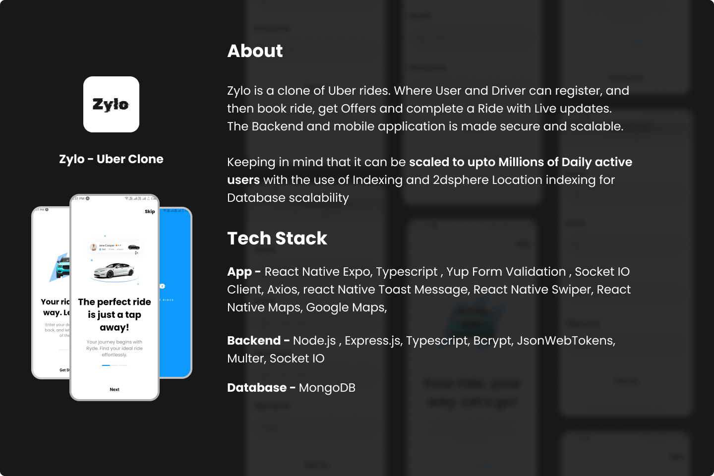
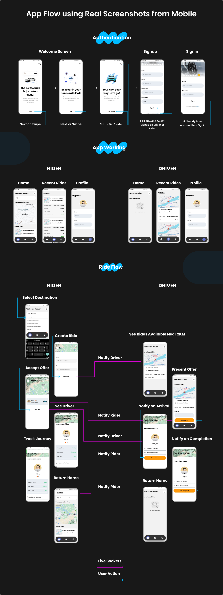

<!-- TABLE OF CONTENTS -->

# 📗 Table of Contents

- [📖 About the Project](#about-project)
  - [🛠 Built With](#built-with)
    - [Tech Stack](#tech-stack)
    - [Key Features](#key-features)
- [👥 Authors](#authors)
- [🤝 Contributing](#contributing)
- [⭐️ Show your support](#support)

<!-- PROJECT DESCRIPTION -->

# 📖 [Zylo] 

### Zylo : Zylo is a clone of Uber rides. Where User and Driver can register, and then book ride, get Offers and complete a Ride with Live updates. The Backend and mobile application is made secure and scalable. 

### Keeping in mind that it can be scaled to upto Millions of Daily active users with the use of Indexing and 2dsphere Location indexing for Database scalability

## 🛠 Built With 

- React Native Expo - Node.js - Express.js - Socket.io - MongoDB - Google Maps

### Tech Stack 

  <ul>
    <li>React Native Expo</li>
    <li>Node.js</li>
    <li>Express.js</li>
    <li>Socket.io</li>
    <li>MongoDB</li>
    <li>Google Maps</li>
  </ul>

<!-- Features -->

### Key Features 

- **[Book Rides]**
- **[Give Offers as a Rider]**
- **[Live Updates]**
- **[Responsive]**

(<a href="#readme-top">back to top</a>)

<!-- AUTHORS -->

## 👥 Authors 

👤 Shayan

- GitHub: [@githubhandle](https://github.com/shayan1234554321)
- Twitter: [@twitterhandle](https://twitter.com/shayan123455432)
- LinkedIn: [LinkedIn](https://www.linkedin.com/in/shayan-khan20/)

(<a href="#readme-top">back to top</a>)

<!-- CONTRIBUTING -->

## 🤝 Contributing 

You can contribute to this project by writing an issue <a href="https://github.com/shayan1234554321/zylo/issues" >here</a>

(<a href="#readme-top">back to top</a>)

<!-- SUPPORT -->

## ⭐️ Show your support 

If you like this project please leave a ⭐️

(<a href="#readme-top">back to top</a>)
